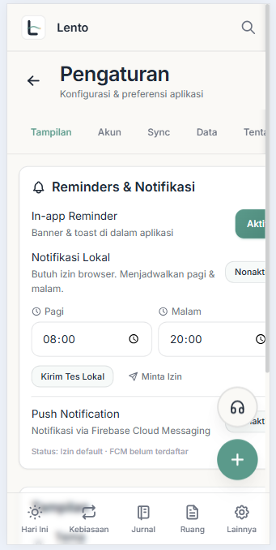
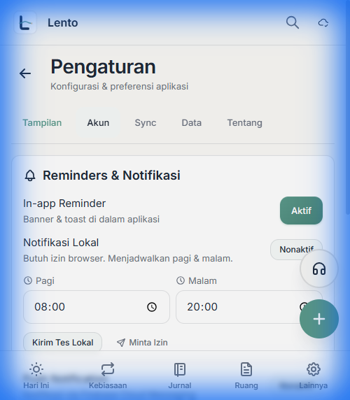

# Fix: Settings Page Mobile Overflow

## Masalah

Halaman **Pengaturan** (`/settings`) mengalami masalah layout terpotong di mode mobile. Konten di sisi kanan (tombol "Aktif"/"Nonaktif" dan tab "Tentang") tidak terlihat penuh.



---

## Analisis Penyebab

### 1. Wrapper Tanpa Overflow Containment

```jsx
// Settings.jsx - sebelum
<div className="flex flex-col -mt-5 lg:-mt-6">
```

Container utama tidak membatasi overflow horizontal.

### 2. Toggle Row Layout Tidak Responsif

```jsx
// Sebelum - div teks tidak bisa shrink
<div className="flex items-center justify-between gap-3">
    <div>  <!-- Tidak ada min-w-0 -->
        <p>Notifikasi Lokal</p>
        <p>Butuh izin browser...</p>
    </div>
    <button className="btn-sm ...">  <!-- Tidak ada flex-shrink-0 -->
        Nonaktif
    </button>
</div>
```

### 3. Tab Bar Tanpa Width Constraint

```jsx
// SettingsTabBar.jsx - sebelum
className="... overflow-x-auto ..."  // Tidak ada max-w-full
```

---

## Solusi

### [Settings.jsx](../src/pages/Settings.jsx)

**1. Tambah `overflow-x-hidden` pada wrapper:**

```diff
-<div className="flex flex-col -mt-5 lg:-mt-6">
+<div className="flex flex-col -mt-5 lg:-mt-6 overflow-x-hidden">
```

**2. Fix toggle rows dengan `min-w-0` dan `flex-shrink-0`:**

```diff
 <div className="flex items-center justify-between gap-3">
-    <div>
+    <div className="min-w-0 flex-1">
         <p>In-app Reminder</p>
         <p>Banner & toast di dalam aplikasi</p>
     </div>
     <button
-        className={`btn-sm ${...}`}
+        className={`btn-sm flex-shrink-0 ${...}`}
     >
         {prefs.inAppEnabled ? 'Aktif' : 'Nonaktif'}
     </button>
 </div>
```

### [SettingsTabBar.jsx](../src/components/settings/SettingsTabBar.jsx)

**Tambah `max-w-full`:**

```diff
 className="sticky top-0 z-10 flex gap-1 px-4 py-2 bg-paper/95 
-     backdrop-blur-sm border-b border-line overflow-x-auto 
+     backdrop-blur-sm border-b border-line overflow-x-auto max-w-full
      scrollbar-hide -webkit-overflow-scrolling-touch"
```

---

## Hasil Verifikasi



✅ Tombol toggle tidak lagi terpotong  
✅ Tab bar scroll horizontal tanpa menyebabkan page overflow  
✅ Layout responsif di viewport 375px

---

## Pola CSS untuk Mencegah Mobile Overflow

| Masalah | Solusi |
|---------|--------|
| Container melebar | `overflow-x-hidden` |
| Flex item tidak shrink | `min-w-0` pada container teks |
| Button/icon terpotong | `flex-shrink-0` |
| Scrollable element overflow | `max-w-full` |
