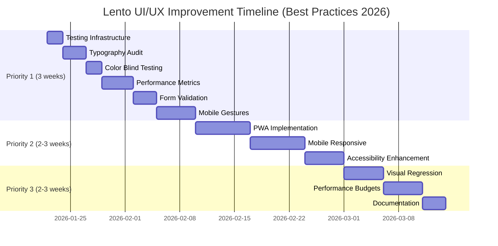

# Lento UI/UX Improvement Roadmap
**Comprehensive Action Plan - Menggabungkan Review Analysis + User Feedback**

## Executive Summary

**Design Score Validation:**
- ✅ Brand-Design Alignment: 10/10 (Agreed - "Less rush. More rhythm" perfectly reflected)
- ✅ Design System Maturity: 9/10 (CSS variables, semantic naming excellent)
- ⚖️ Dark Mode: Keep #121212 for now, A/B test optional (User feedback considered)
- ⬆️ Mobile-First: Revised to 4.5/5 (Need actual device testing)
- ✅ Accessibility: 9/10 with room for enhancement

**Key Strengths to Maintain:**
- Warm color palette (teal + amber)
- Generous whitespace & rounded corners
- No-shame microcopy
- Consistent spacing (4px base unit)

**Critical Missing Points Identified:**
1. Typography minimum sizes not validated on mobile
2. Color blind testing not performed
3. Real-world performance metrics missing
4. Form validation/error handling inconsistent
5. Mobile gestures & testing infrastructure (moved to Priority 1 for mobile-first)
6. PWA offline-first capability not yet implemented

**Best Practices 2026 Applied:**
- ✅ Mobile-first: Gestures in Priority 1, not afterthought
- ✅ Testing-first: Infrastructure setup parallel with development
- ✅ Accessibility: Respect prefers-reduced-motion for haptics
- ✅ Performance: Lighthouse CI from day 1, not Priority 3

---

## PRIORITY 1 - CRITICAL (3 minggu) 🔥
*Timeline adjusted untuk solo developer + internship bandwidth*

### 1.1 Typography Audit & Minimum Size Validation

**Problem:**
- Font size untuk secondary text belum di-validate
- Mobile readability questionable (contoh: "Hidrasi sepanjang hari" terlihat kecil)
- Tidak ada enforcement untuk minimum 13px rule

**Action:**
```css
/* location: src/index.css */

/* ENFORCE minimum text sizes with fluid typography */
:root {
  --text-min: 0.8125rem; /* 13px - WCAG minimum for body text */
  --text-body: clamp(0.9375rem, 2vw, 1rem); /* 15px → 16px fluid */
  --text-small: clamp(0.875rem, 1.5vw, 0.9375rem); /* 14px → 15px fluid */
  --text-caption: 0.75rem; /* 12px - labels only, not for reading */
}

/* Fluid typography scales better across devices without breakpoints */

/* Validate: No text should be smaller than caption (12px) */
@media (max-width: 640px) {
  /* Mobile: bump up by 1px for better readability */
  :root {
    --text-body: 1rem; /* 16px on mobile */
    --text-small: 0.9375rem; /* 15px on mobile */
  }
}

/* Apply to problematic components */
.habit-subtitle,
.journal-prompt,
.finance-label {
  font-size: var(--text-small);
  min-height: 1.25rem; /* Ensure minimum touch target */
}

/* Flag violations in development */
@layer utilities {
  .text-too-small {
    @apply text-xs; /* 12px */
    outline: 2px solid red; /* DEV only warning */
  }
}
```

**Testing Checklist:**
```bash
# Run this audit script
npm run audit:typography

# Manual validation on devices:
- iPhone SE (smallest modern screen)
- Samsung A12 (budget Android)
- Desktop at 1920x1080
- Desktop at 2560x1440 (retina)

# Check these components specifically:
✓ Habit list items
✓ Journal prompts
✓ Finance transaction labels
✓ Calendar event titles
✓ Bottom navigation labels
```

---

### 1.2 Color Blind Accessibility Testing

**Problem:**
- Teal + amber combination belum di-test untuk deuteranopia/protanopia
- Reliance on color alone untuk status indicators
- No alternative visual cues

**Action:**

```jsx
// 1. Create ColorBlindSimulator utility
// location: src/utils/colorBlindSimulator.ts

export const simulateColorBlindness = (
  color: string,
  type: 'deuteranopia' | 'protanopia' | 'tritanopia'
): string => {
  // Matrix transformations for color blind simulation
  const matrices = {
    deuteranopia: [
      0.625, 0.375, 0, 0, 0,
      0.7, 0.3, 0, 0, 0,
      0, 0.3, 0.7, 0, 0,
      0, 0, 0, 1, 0
    ],
    protanopia: [
      0.567, 0.433, 0, 0, 0,
      0.558, 0.442, 0, 0, 0,
      0, 0.242, 0.758, 0, 0,
      0, 0, 0, 1, 0
    ],
    tritanopia: [
      0.95, 0.05, 0, 0, 0,
      0, 0.433, 0.567, 0, 0,
      0, 0.475, 0.525, 0, 0,
      0, 0, 0, 1, 0
    ]
  };

  // Apply matrix transformation
  // Implementation details...
  return transformedColor;
};

// 2. Add pattern indicators alongside colors
// location: src/components/StatusBadge.tsx

interface StatusBadgeProps {
  status: 'active' | 'completed' | 'paused';
  label: string;
}

export const StatusBadge: React.FC<StatusBadgeProps> = ({ status, label }) => {
  const config = {
    active: {
      bg: 'bg-teal-100',
      text: 'text-teal-700',
      icon: '●', // Solid circle
      border: 'border-teal-300'
    },
    completed: {
      bg: 'bg-green-100',
      text: 'text-green-700',
      icon: '✓', // Checkmark
      border: 'border-green-300'
    },
    paused: {
      bg: 'bg-amber-100',
      text: 'text-amber-700',
      icon: '⏸', // Pause symbol
      border: 'border-amber-300'
    }
  };

  const style = config[status];

  return (
    <span
      className={`inline-flex items-center gap-1.5 px-2 py-1 rounded-md text-xs font-medium border ${style.bg} ${style.text} ${style.border}`}
      role="status"
      aria-label={`Status: ${label}`}
    >
      <span aria-hidden="true">{style.icon}</span>
      {label}
    </span>
  );
};

// 3. Progress indicators dengan pattern
// location: src/components/ProgressRing.tsx

export const ProgressRing: React.FC<{ value: number; max: number }> = ({ value, max }) => {
  const percentage = (value / max) * 100;

  return (
    <div className="relative w-16 h-16">
      {/* Background ring */}
      <svg className="w-full h-full transform -rotate-90">
        <circle
          cx="32"
          cy="32"
          r="28"
          fill="none"
          stroke="currentColor"
          strokeWidth="6"
          className="text-gray-200"
        />
        {/* Progress ring dengan dashed pattern untuk color blind users */}
        <circle
          cx="32"
          cy="32"
          r="28"
          fill="none"
          stroke="currentColor"
          strokeWidth="6"
          strokeDasharray="176"
          strokeDashoffset={176 - (176 * percentage) / 100}
          strokeLinecap="round"
          className="text-teal-600 transition-all duration-300"
          style={{
            strokeDasharray: `4 2`, // Dashed pattern
          }}
        />
      </svg>

      {/* Center text */}
      <div className="absolute inset-0 flex items-center justify-center">
        <span className="text-sm font-bold text-ink-900">{value}/{max}</span>
      </div>
    </div>
  );
};
```

**Testing Protocol:**
```bash
# Online tools untuk testing:
1. Coblis Color Blindness Simulator
   https://www.color-blindness.com/coblis-color-blindness-simulator/

2. Color Oracle (Desktop app)
   https://colororacle.org/

3. Chrome DevTools: Emulate vision deficiencies
   DevTools > Rendering > Emulate vision deficiencies

# Manual checks:
✓ All status badges have icons + text (not color only)
✓ Progress bars use patterns or textures
✓ Charts use different shapes (not just colors)
✓ Links underlined (not just blue)
✓ Error states use icons (not just red text)
```

---

### 1.3 Performance Metrics & Optimization

**Problem:**
- No Core Web Vitals baseline
- Bundle size unknown
- Loading performance di 3G networks tidak terukur

**Action:**

```typescript
// 1. Setup Performance Monitoring
// location: src/utils/performanceMonitor.ts

export const measurePerformance = () => {
  if (typeof window === 'undefined') return;

  // Measure Core Web Vitals
  const observer = new PerformanceObserver((list) => {
    for (const entry of list.getEntries()) {
      // Log to analytics service
      console.log({
        metric: entry.name,
        value: entry.value,
        rating: entry.rating,
      });

      // Send to backend for aggregation
      if (process.env.NODE_ENV === 'production') {
        fetch('/api/analytics/webvitals', {
          method: 'POST',
          body: JSON.stringify({
            metric: entry.name,
            value: entry.value,
            url: window.location.pathname,
          }),
        });
      }
    }
  });

  // Observe: LCP, FID, CLS
  observer.observe({ entryTypes: ['largest-contentful-paint', 'first-input', 'layout-shift'] });

  // Measure Time to Interactive
  if ('PerformanceNavigationTiming' in window) {
    const navTiming = performance.getEntriesByType('navigation')[0] as PerformanceNavigationTiming;
    const tti = navTiming.domInteractive - navTiming.fetchStart;
    console.log('Time to Interactive:', tti, 'ms');
  }
};

// 2. Implement Code Splitting
// location: src/App.tsx

import { lazy, Suspense } from 'react';

// Lazy load heavy pages
const Dashboard = lazy(() => import('./pages/Dashboard'));
const Habits = lazy(() => import('./pages/Habits'));
const Finance = lazy(() => import('./pages/Finance'));
const Stats = lazy(() => import('./pages/Stats'));

export const App: React.FC = () => {
  return (
    <Suspense fallback={<DashboardSkeleton />}>
      <Routes>
        <Route path="/" element={<Dashboard />} />
        <Route path="/habits" element={<Habits />} />
        <Route path="/finance" element={<Finance />} />
        <Route path="/stats" element={<Stats />} />
      </Routes>
    </Suspense>
  );
};

// 3. Optimize images
// location: vite.config.ts

import imagemin from 'vite-plugin-imagemin';

export default defineConfig({
  plugins: [
    react(),
    imagemin({
      gifsicle: { optimizationLevel: 7 },
      optipng: { optimizationLevel: 7 },
      mozjpeg: { quality: 85 },
      svgo: {
        plugins: [
          { name: 'removeViewBox', active: false },
          { name: 'removeEmptyAttrs', active: true },
        ],
      },
    }),
  ],
  build: {
    rollupOptions: {
      output: {
        manualChunks: {
          vendor: ['react', 'react-dom', 'react-router-dom'],
          ui: ['@tabler/icons-react'],
        },
      },
    },
  },
});

// 4. Setup bundle analysis
// package.json scripts
{
  "scripts": {
    "analyze": "vite-bundle-analyzer",
    "lighthouse": "lighthouse https://lento-flame.vercel.app --output html --output-path ./reports/lighthouse.html",
    "test:perf": "playwright test performance"
  }
}
```

**Performance Targets:**
```yaml
Core Web Vitals Targets:
  LCP (Largest Contentful Paint): < 2.5s
  FID (First Input Delay): < 100ms
  CLS (Cumulative Layout Shift): < 0.1

Bundle Size Targets:
  Initial JS Bundle: < 150KB (gzipped)
  Initial CSS: < 30KB (gzipped)
  Images: WebP format, < 100KB each

Network Conditions Testing:
  3G Fast: 1.6 Mbps, 150ms RTT
  3G Slow: 400 Kbps, 400ms RTT
  4G: 4 Mbps, 20ms RTT

Success Criteria:
  Time to Interactive (3G): < 5s
  Time to Interactive (4G): < 3s
  Lighthouse Score: > 90
```

---

### 1.4 Form Validation & Error Handling UX

**Problem:**
- Inconsistent error messages
- Tidak ada real-time validation
- Error states tidak engaging

**Implementation:**

```tsx
// 1. Create Form Validation Hook
// location: src/hooks/useFormValidation.ts

interface ValidationRule {
  required?: boolean;
  minLength?: number;
  maxLength?: number;
  pattern?: RegExp;
  custom?: (value: any) => string | null;
}

interface ValidationSchema {
  [field: string]: ValidationRule;
}

export const useFormValidation = <T extends Record<string, any>>(
  schema: ValidationSchema,
  initialValues: T
) => {
  const [values, setValues] = useState<T>(initialValues);
  const [errors, setErrors] = useState<Partial<Record<keyof T, string>>>({});
  const [touched, setTouched] = useState<Partial<Record<keyof T, boolean>>>({});

  const validate = (field: keyof T, value: any): string | null => {
    const rules = schema[field as string];
    if (!rules) return null;

    // Required validation
    if (rules.required && !value) {
      return 'Field ini wajib diisi';
    }

    // Min length
    if (rules.minLength && value.length < rules.minLength) {
      return `Minimal ${rules.minLength} karakter`;
    }

    // Max length
    if (rules.maxLength && value.length > rules.maxLength) {
      return `Maksimal ${rules.maxLength} karakter`;
    }

    // Pattern matching
    if (rules.pattern && !rules.pattern.test(value)) {
      return 'Format tidak valid';
    }

    // Custom validation
    if (rules.custom) {
      return rules.custom(value);
    }

    return null;
  };

  const handleChange = (field: keyof T, value: any) => {
    setValues((prev) => ({ ...prev, [field]: value }));

    // Real-time validation if field is touched
    if (touched[field]) {
      const error = validate(field, value);
      setErrors((prev) => ({ ...prev, [field]: error || undefined }));
    }
  };

  const handleBlur = (field: keyof T) => {
    setTouched((prev) => ({ ...prev, [field]: true }));
    const error = validate(field, values[field]);
    setErrors((prev) => ({ ...prev, [field]: error || undefined }));
  };

  const validateAll = (): boolean => {
    const newErrors: Partial<Record<keyof T, string>> = {};
    let isValid = true;

    Object.keys(schema).forEach((field) => {
      const error = validate(field as keyof T, values[field as keyof T]);
      if (error) {
        newErrors[field as keyof T] = error;
        isValid = false;
      }
    });

    setErrors(newErrors);
    return isValid;
  };

  const reset = () => {
    setValues(initialValues);
    setErrors({});
    setTouched({});
  };

  return {
    values,
    errors,
    touched,
    handleChange,
    handleBlur,
    validateAll,
    reset,
  };
};

// 2. Usage Example
// location: src/components/CreateHabitForm.tsx

export const CreateHabitForm: React.FC = () => {
  const { values, errors, touched, handleChange, handleBlur, validateAll } =
    useFormValidation(
      {
        name: {
          required: true,
          minLength: 3,
          maxLength: 50,
        },
        frequency: {
          required: true,
        },
        category: {
          required: true,
        },
      },
      { name: '', frequency: 'daily', category: '' }
    );

  const handleSubmit = async (e: React.FormEvent) => {
    e.preventDefault();

    if (!validateAll()) {
      toast.error('Mohon isi semua field yang wajib');
      return;
    }

    try {
      await createHabit(values);
      toast.success('Kebiasaan berhasil dibuat!');
    } catch (error) {
      toast.error('Gagal membuat kebiasaan. Coba lagi.');
    }
  };

  return (
    <form onSubmit={handleSubmit} className="space-y-4">
      <FormField
        label="Nama Kebiasaan"
        error={touched.name ? errors.name : undefined}
        required
      >
        <Input
          value={values.name}
          onChange={(e) => handleChange('name', e.target.value)}
          onBlur={() => handleBlur('name')}
          placeholder="Contoh: Minum air 8 gelas"
          hasError={touched.name && !!errors.name}
        />
      </FormField>

      {/* Other fields... */}
    </form>
  );
};
```

---

### 1.5 Mobile Gestures & Native-like Feel
**[MOVED FROM PRIORITY 2 - Mobile-First Best Practice 2026]**

**Problem:**
- Gestures sebagai afterthought, bukan foundation
- Mobile experience feels like web, not native
- Best practice 2026: Mobile-first means gestures di Priority 1

**Action:**

```tsx
// 1. Pull-to-Refresh Component
// location: src/components/PullToRefresh.tsx

import { useState, useEffect, useRef } from 'react';

interface PullToRefreshProps {
  onRefresh: () => Promise<void>;
  children: React.ReactNode;
}

export const PullToRefresh: React.FC<PullToRefreshProps> = ({ onRefresh, children }) => {
  const [pulling, setPulling] = useState(false);
  const [refreshing, setRefreshing] = useState(false);
  const [pullDistance, setPullDistance] = useState(0);
  const startY = useRef(0);

  const PULL_THRESHOLD = 80;

  const handleTouchStart = (e: TouchEvent) => {
    if (window.scrollY === 0) {
      startY.current = e.touches[0].clientY;
    }
  };

  const handleTouchMove = (e: TouchEvent) => {
    if (window.scrollY > 0) return;

    const currentY = e.touches[0].clientY;
    const distance = currentY - startY.current;

    if (distance > 0) {
      setPulling(true);
      setPullDistance(Math.min(distance, PULL_THRESHOLD * 1.5));
    }
  };

  const handleTouchEnd = async () => {
    if (pullDistance >= PULL_THRESHOLD) {
      setRefreshing(true);
      try {
        await onRefresh();
      } finally {
        setRefreshing(false);
      }
    }

    setPulling(false);
    setPullDistance(0);
  };

  useEffect(() => {
    window.addEventListener('touchstart', handleTouchStart);
    window.addEventListener('touchmove', handleTouchMove);
    window.addEventListener('touchend', handleTouchEnd);

    return () => {
      window.removeEventListener('touchstart', handleTouchStart);
      window.removeEventListener('touchmove', handleTouchMove);
      window.removeEventListener('touchend', handleTouchEnd);
    };
  }, [pullDistance]);

  return (
    <div className="relative">
      <div
        className="absolute top-0 left-0 right-0 flex items-center justify-center transition-all"
        style={{
          height: `${pullDistance}px`,
          opacity: pulling ? 1 : 0,
        }}
      >
        {refreshing ? (
          <svg className="w-6 h-6 animate-spin text-teal-600" viewBox="0 0 24 24">
            <circle className="opacity-25" cx="12" cy="12" r="10" stroke="currentColor" strokeWidth="4" fill="none" />
            <path className="opacity-75" fill="currentColor" d="M4 12a8 8 0 018-8V0C5.373 0 0 5.373 0 12h4zm2 5.291A7.962 7.962 0 014 12H0c0 3.042 1.135 5.824 3 7.938l3-2.647z" />
          </svg>
        ) : (
          <svg className="w-6 h-6 text-teal-600" fill="none" viewBox="0 0 24 24" stroke="currentColor">
            <path strokeLinecap="round" strokeLinejoin="round" strokeWidth={2} d="M19 14l-7 7m0 0l-7-7m7 7V3" />
          </svg>
        )}
      </div>
      {children}
    </div>
  );
};

// 2. Swipe Gesture Hook
// location: src/hooks/useSwipeGesture.ts

interface SwipeConfig {
  onSwipeLeft?: () => void;
  onSwipeRight?: () => void;
  threshold?: number;
}

export const useSwipeGesture = (config: SwipeConfig) => {
  const { onSwipeLeft, onSwipeRight, threshold = 50 } = config;
  const [startX, setStartX] = useState(0);
  const [startY, setStartY] = useState(0);

  const handleTouchStart = (e: React.TouchEvent) => {
    setStartX(e.touches[0].clientX);
    setStartY(e.touches[0].clientY);
  };

  const handleTouchEnd = (e: React.TouchEvent) => {
    const endX = e.changedTouches[0].clientX;
    const endY = e.changedTouches[0].clientY;

    const deltaX = endX - startX;
    const deltaY = endY - startY;

    if (Math.abs(deltaX) > Math.abs(deltaY)) {
      if (Math.abs(deltaX) > threshold) {
        if (deltaX > 0 && onSwipeRight) onSwipeRight();
        else if (deltaX < 0 && onSwipeLeft) onSwipeLeft();
      }
    }
  };

  return { onTouchStart: handleTouchStart, onTouchEnd: handleTouchEnd };
};
```

**Haptic Feedback with Accessibility:**
```typescript
// location: src/utils/haptics.ts

export const haptics = {
  // Check prefers-reduced-motion before triggering vibration
  shouldVibrate: () => {
    return (
      'vibrate' in navigator &&
      !window.matchMedia('(prefers-reduced-motion: reduce)').matches
    );
  },

  light: () => {
    if (haptics.shouldVibrate()) {
      navigator.vibrate(10);
    }
  },

  medium: () => {
    if (haptics.shouldVibrate()) {
      navigator.vibrate(20);
    }
  },

  heavy: () => {
    if (haptics.shouldVibrate()) {
      navigator.vibrate([30, 10, 30]);
    }
  },

  success: () => {
    if (haptics.shouldVibrate()) {
      navigator.vibrate([20, 10, 20]);
    }
  },

  error: () => {
    if (haptics.shouldVibrate()) {
      navigator.vibrate([50, 30, 50]);
    }
  },
};

// Usage example:
import { haptics } from '@/utils/haptics';

const handleComplete = () => {
  completeHabit();
  haptics.success(); // Only vibrates if user hasn't disabled motion
};
```

**Testing:**
```bash
# Test on actual devices (emulator tidak cukup untuk gesture feel)
- iOS Safari (iPhone 13 Pro)
- Android Chrome (Samsung A12)
- Test dengan screen reader ON
- Test dengan reduced motion enabled

✓ Pull-to-refresh triggers at 80px
✓ Swipe left/right navigates between views
✓ Haptic feedback respects system settings
✓ No vibration when prefers-reduced-motion: reduce
```

---

### 1.6 Testing Infrastructure Setup
**[MOVED FROM PRIORITY 3 - Testing-First Best Practice 2026]**

**Problem:**
- Comprehensive testing di Priority 3 terlalu terlambat
- Best practice 2026: Testing infrastructure dari hari pertama
- TDD atau minimal testing parallel dengan development

**Action:**

```typescript
// 1. Setup Playwright untuk E2E
// package.json
{
  "scripts": {
    "test": "vitest",
    "test:e2e": "playwright test",
    "test:coverage": "vitest --coverage",
    "lighthouse": "lighthouse https://lento-flame.vercel.app --output html"
  },
  "devDependencies": {
    "@playwright/test": "^1.40.0",
    "@vitest/coverage-v8": "^1.0.0",
    "@axe-core/playwright": "^4.8.0",
    "lighthouse": "^11.0.0"
  }
}

// 2. Lighthouse CI Setup
// .github/workflows/lighthouse-ci.yml

name: Lighthouse CI

on:
  push:
    branches: [main]
  pull_request:
    branches: [main]

jobs:
  lighthouse:
    runs-on: ubuntu-latest
    steps:
      - uses: actions/checkout@v3
      - name: Run Lighthouse CI
        uses: treosh/lighthouse-ci-action@v10
        with:
          urls: |
            https://lento-flame.vercel.app
            https://lento-flame.vercel.app/habits
            https://lento-flame.vercel.app/finance
          uploadArtifacts: true
          temporaryPublicStorage: true
          budgetPath: ./lighthouse-budget.json

// 3. Lighthouse Budget
// lighthouse-budget.json

[
  {
    "path": "/*",
    "timings": [
      { "metric": "first-contentful-paint", "budget": 2000 },
      { "metric": "largest-contentful-paint", "budget": 2500 },
      { "metric": "interactive", "budget": 3000 }
    ],
    "resourceSizes": [
      { "resourceType": "script", "budget": 150 },
      { "resourceType": "stylesheet", "budget": 30 },
      { "resourceType": "image", "budget": 200 },
      { "resourceType": "total", "budget": 500 }
    ]
  }
]

// 4. Accessibility Testing Setup
// tests/a11y/accessibility.spec.ts

import { test, expect } from '@playwright/test';
import AxeBuilder from '@axe-core/playwright';

test('homepage accessibility', async ({ page }) => {
  await page.goto('/');
  
  const results = await new AxeBuilder({ page }).analyze();
  
  expect(results.violations).toEqual([]);
});

test('keyboard navigation', async ({ page }) => {
  await page.goto('/');
  
  // Tab through all interactive elements
  await page.keyboard.press('Tab');
  await expect(page.locator(':focus')).toBeVisible();
  
  // Enter key should activate buttons
  await page.keyboard.press('Enter');
});
```

**Success Criteria:**
```yaml
Week 1 (Priority 1):
  ✓ Lighthouse CI running on every PR
  ✓ Accessibility tests catch violations
  ✓ Performance budget enforced
  ✓ Visual regression baseline captured

Testing Coverage:
  Unit: 80%+ (Vitest)
  E2E: Critical paths (Playwright)
  Accessibility: All pages (axe-core)
  Performance: All routes (Lighthouse)
```

---

## PRIORITY 2 - HIGH (2-3 minggu) ⚡

### 2.1 Progressive Web App (PWA) Implementation
**[NEW - Best Practice 2026: Offline-First for Habit Tracking]**

**Problem:**
- Tidak ada offline capability
- Habit tracking app harus bisa dipakai tanpa internet
- Service worker untuk caching belum optimal
- Install prompt untuk home screen belum ada

**Action:**

```typescript
// 1. Service Worker Strategy
// location: src/sw.js

import { precacheAndRoute } from 'workbox-precaching';
import { registerRoute } from 'workbox-routing';
import { CacheFirst, NetworkFirst, StaleWhileRevalidate } from 'workbox-strategies';
import { ExpirationPlugin } from 'workbox-expiration';

// Precache app shell
precacheAndRoute(self.__WB_MANIFEST);

// Cache API responses
registerRoute(
  ({ url }) => url.pathname.startsWith('/api/'),
  new NetworkFirst({
    cacheName: 'api-cache',
    plugins: [
      new ExpirationPlugin({
        maxEntries: 50,
        maxAgeSeconds: 5 * 60, // 5 minutes
      }),
    ],
  })
);

// Cache images
registerRoute(
  ({ request }) => request.destination === 'image',
  new CacheFirst({
    cacheName: 'image-cache',
    plugins: [
      new ExpirationPlugin({
        maxEntries: 100,
        maxAgeSeconds: 30 * 24 * 60 * 60, // 30 days
      }),
    ],
  })
);

// Cache Firebase Data Connect queries (offline-first habits)
registerRoute(
  ({ url }) => url.pathname.includes('dataconnect'),
  new StaleWhileRevalidate({
    cacheName: 'dataconnect-cache',
    plugins: [
      new ExpirationPlugin({
        maxEntries: 30,
        maxAgeSeconds: 24 * 60 * 60, // 1 day
      }),
    ],
  })
);

// Background sync for offline habit completion
self.addEventListener('sync', (event) => {
  if (event.tag === 'sync-habits') {
    event.waitUntil(syncHabits());
  }
});

async function syncHabits() {
  const db = await openDB('lento-offline', 1);
  const habits = await db.getAll('pending-habits');
  
  for (const habit of habits) {
    try {
      await fetch('/api/habits/complete', {
        method: 'POST',
        body: JSON.stringify(habit),
      });
      await db.delete('pending-habits', habit.id);
    } catch (err) {
      console.error('Sync failed:', err);
    }
  }
}

// 2. Install Prompt
// location: src/components/PWAInstallPrompt.tsx

import { useState, useEffect } from 'react';

export const PWAInstallPrompt: React.FC = () => {
  const [deferredPrompt, setDeferredPrompt] = useState<any>(null);
  const [showPrompt, setShowPrompt] = useState(false);

  useEffect(() => {
    const handler = (e: Event) => {
      e.preventDefault();
      setDeferredPrompt(e);
      setShowPrompt(true);
    };

    window.addEventListener('beforeinstallprompt', handler);

    return () => {
      window.removeEventListener('beforeinstallprompt', handler);
    };
  }, []);

  const handleInstall = async () => {
    if (!deferredPrompt) return;

    deferredPrompt.prompt();
    const { outcome } = await deferredPrompt.userChoice;

    if (outcome === 'accepted') {
      console.log('PWA installed');
    }

    setDeferredPrompt(null);
    setShowPrompt(false);
  };

  if (!showPrompt) return null;

  return (
    <div className="fixed bottom-20 left-4 right-4 bg-white dark:bg-gray-800 p-4 rounded-xl shadow-lg border-2 border-teal-500">
      <div className="flex items-start gap-3">
        
        <div className="flex-1">
          <h3 className="font-bold text-ink-900 dark:text-ink-100">Install Lento</h3>
          <p className="text-sm text-ink-600 dark:text-ink-400">Add to home screen for offline access</p>
        </div>
      </div>
      <div className="flex gap-2 mt-3">
        <button
          onClick={handleInstall}
          className="flex-1 bg-teal-600 text-white px-4 py-2 rounded-lg font-medium"
        >
          Install
        </button>
        <button
          onClick={() => setShowPrompt(false)}
          className="px-4 py-2 text-ink-600 dark:text-ink-400"
        >
          Later
        </button>
      </div>
    </div>
  );
};

// 3. Offline Indicator
// location: src/components/OfflineIndicator.tsx

import { useState, useEffect } from 'react';

export const OfflineIndicator: React.FC = () => {
  const [isOnline, setIsOnline] = useState(navigator.onLine);

  useEffect(() => {
    const handleOnline = () => setIsOnline(true);
    const handleOffline = () => setIsOnline(false);

    window.addEventListener('online', handleOnline);
    window.addEventListener('offline', handleOffline);

    return () => {
      window.removeEventListener('online', handleOnline);
      window.removeEventListener('offline', handleOffline);
    };
  }, []);

  if (isOnline) return null;

  return (
    <div className="fixed top-16 left-4 right-4 bg-amber-500 text-white px-4 py-2 rounded-lg shadow-lg flex items-center gap-2 z-50">
      <svg className="w-5 h-5" fill="none" viewBox="0 0 24 24" stroke="currentColor">
        <path strokeLinecap="round" strokeLinejoin="round" strokeWidth={2} d="M18.364 5.636a9 9 0 010 12.728m0 0l-2.829-2.829m2.829 2.829L21 21M15.536 8.464a5 5 0 010 7.072m0 0l-2.829-2.829m-4.243 2.829a4.978 4.978 0 01-1.414-2.83m-1.414 5.658a9 9 0 01-2.167-9.238m7.824 2.167a1 1 0 111.414 1.414m-1.414-1.414L3 3" />
      </svg>
      <span className="text-sm font-medium">You're offline. Changes will sync when online.</span>
    </div>
  );
};
```

**Manifest Update:**
```json
// location: public/manifest.json

{
  "name": "Lento - Habit Tracker",
  "short_name": "Lento",
  "description": "Less rush. More rhythm. Track your habits offline.",
  "start_url": "/",
  "display": "standalone",
  "background_color": "#FAF9F6",
  "theme_color": "#5B9A8B",
  "orientation": "portrait",
  "icons": [
    {
      "src": "/icons/icon-192x192.png",
      "sizes": "192x192",
      "type": "image/png",
      "purpose": "maskable"
    },
    {
      "src": "/icons/icon-512x512.png",
      "sizes": "512x512",
      "type": "image/png",
      "purpose": "any"
    }
  ],
  "shortcuts": [
    {
      "name": "Add Habit",
      "short_name": "New Habit",
      "url": "/habits/new",
      "icons": [{ "src": "/shortcuts/add-habit.png", "sizes": "96x96" }]
    },
    {
      "name": "Today",
      "url": "/",
      "icons": [{ "src": "/shortcuts/today.png", "sizes": "96x96" }]
    }
  ]
}
```

**Testing:**
```bash
# PWA Checklist
✓ Manifest.json valid
✓ Service worker registers successfully
✓ Install prompt appears on eligible devices
✓ Offline mode works (test with DevTools Network: Offline)
✓ Background sync queues actions when offline
✓ Cache invalidation works correctly
✓ Lighthouse PWA score > 90

# Test Scenarios:
1. Complete habit while offline → syncs when online
2. View cached habits while offline
3. Install to home screen → opens in standalone mode
4. Background sync triggered on reconnect
```

---

### 2.2 Mobile Responsive Refinement

**Problem:**
- No pull-to-refresh
- No swipe gestures untuk navigasi
- Tidak ada haptic feedback

**Problem:**
- No pull-to-refresh
- No swipe gestures untuk navigasi
- Tidak ada haptic feedback

**Implementation:**

```tsx
// 1. Pull-to-Refresh Component
// location: src/components/PullToRefresh.tsx

import { useState, useEffect, useRef } from 'react';

interface PullToRefreshProps {
  onRefresh: () => Promise<void>;
  children: React.ReactNode;
}

export const PullToRefresh: React.FC<PullToRefreshProps> = ({
  onRefresh,
  children,
}) => {
  const [pulling, setPulling] = useState(false);
  const [pullDistance, setPullDistance] = useState(0);
  const [refreshing, setRefreshing] = useState(false);
  const startY = useRef(0);

  const PULL_THRESHOLD = 80; // pixels to trigger refresh

  const handleTouchStart = (e: TouchEvent) => {
    if (window.scrollY === 0) {
      startY.current = e.touches[0].clientY;
    }
  };

  const handleTouchMove = (e: TouchEvent) => {
    if (window.scrollY > 0) return;

    const currentY = e.touches[0].clientY;
    const distance = currentY - startY.current;

    if (distance > 0) {
      setPulling(true);
      setPullDistance(Math.min(distance, PULL_THRESHOLD * 1.5));
    }
  };

  const handleTouchEnd = async () => {
    if (pullDistance >= PULL_THRESHOLD) {
      setRefreshing(true);
      try {
        await onRefresh();
      } finally {
        setRefreshing(false);
      }
    }

    setPulling(false);
    setPullDistance(0);
  };

  useEffect(() => {
    window.addEventListener('touchstart', handleTouchStart);
    window.addEventListener('touchmove', handleTouchMove);
    window.addEventListener('touchend', handleTouchEnd);

    return () => {
      window.removeEventListener('touchstart', handleTouchStart);
      window.removeEventListener('touchmove', handleTouchMove);
      window.removeEventListener('touchend', handleTouchEnd);
    };
  }, [pullDistance]);

  return (
    <div className="relative">
      {/* Pull indicator */}
      <div
        className="absolute top-0 left-0 right-0 flex items-center justify-center transition-all"
        style={{
          height: `${pullDistance}px`,
          opacity: pulling ? 1 : 0,
        }}
      >
        {refreshing ? (
          <svg className="w-6 h-6 animate-spin text-teal-600" viewBox="0 0 24 24">
            <circle className="opacity-25" cx="12" cy="12" r="10" stroke="currentColor" strokeWidth="4" fill="none" />
            <path className="opacity-75" fill="currentColor" d="M4 12a8 8 0 018-8V0C5.373 0 0 5.373 0 12h4zm2 5.291A7.962 7.962 0 014 12H0c0 3.042 1.135 5.824 3 7.938l3-2.647z" />
          </svg>
        ) : (
          <svg className="w-6 h-6 text-teal-600" fill="none" viewBox="0 0 24 24" stroke="currentColor">
            <path strokeLinecap="round" strokeLinejoin="round" strokeWidth={2} d="M19 14l-7 7m0 0l-7-7m7 7V3" />
          </svg>
        )}
      </div>

      {children}
    </div>
  );
};

// 2. Swipe Gesture Hook
// location: src/hooks/useSwipeGesture.ts

interface SwipeConfig {
  onSwipeLeft?: () => void;
  onSwipeRight?: () => void;
  threshold?: number;
}

export const useSwipeGesture = (config: SwipeConfig) => {
  const { onSwipeLeft, onSwipeRight, threshold = 50 } = config;

  const [startX, setStartX] = useState(0);
  const [startY, setStartY] = useState(0);

  const handleTouchStart = (e: React.TouchEvent) => {
    setStartX(e.touches[0].clientX);
    setStartY(e.touches[0].clientY);
  };

  const handleTouchEnd = (e: React.TouchEvent) => {
    const endX = e.changedTouches[0].clientX;
    const endY = e.changedTouches[0].clientY;

    const deltaX = endX - startX;
    const deltaY = endY - startY;

    // Only trigger if horizontal swipe is dominant
    if (Math.abs(deltaX) > Math.abs(deltaY)) {
      if (Math.abs(deltaX) > threshold) {
        if (deltaX > 0 && onSwipeRight) {
          onSwipeRight();
        } else if (deltaX < 0 && onSwipeLeft) {
          onSwipeLeft();
        }
      }
    }
  };

  return {
    onTouchStart: handleTouchStart,
    onTouchEnd: handleTouchEnd,
  };
};

// 3. Haptic Feedback Utility
// location: src/utils/haptics.ts

export const haptics = {
  light: () => {
    if ('vibrate' in navigator) {
      navigator.vibrate(10);
    }
  },

  medium: () => {
    if ('vibrate' in navigator) {
      navigator.vibrate(20);
    }
  },

  heavy: () => {
    if ('vibrate' in navigator) {
      navigator.vibrate([30, 10, 30]);
    }
  },

  success: () => {
    if ('vibrate' in navigator) {
      navigator.vibrate([20, 10, 20]);
    }
  },

  error: () => {
    if ('vibrate' in navigator) {
      navigator.vibrate([50, 30, 50]);
    }
  },
};

// 4. Usage dalam Habit Check-in
// location: src/components/HabitCheckbox.tsx

export const HabitCheckbox: React.FC<{ habit: Habit }> = ({ habit }) => {
  const [checked, setChecked] = useState(false);

  const handleCheck = () => {
    setChecked(!checked);
    
    // Haptic feedback
    if (!checked) {
      haptics.success();
    } else {
      haptics.light();
    }
  };

  return (
    <button
      onClick={handleCheck}
      className={`...`}
      aria-pressed={checked}
    >
      {/* Checkbox UI */}
    </button>
  );
};
```

---

## PRIORITY 3 - MEDIUM (3-4 minggu) 📊

### 3.1 Comprehensive Testing Strategy

**Test Coverage Required:**

```yaml
# test-coverage-targets.yml

Unit Tests:
  Coverage Target: 80%
  Critical Components:
    - Form validation: 100%
    - Authentication flow: 100%
    - Data calculations: 100%
    - Utility functions: 95%

Integration Tests:
  Priority Pages:
    - Dashboard: Full user flow
    - Habits: Create, check-in, streak
    - Journal: Quick entry, history
    - Finance: Transaction CRUD

E2E Tests:
  Critical Paths:
    - User onboarding
    - Create habit → Check-in → View streak
    - Write journal → View history
    - Add transaction → View summary
    - Dark mode toggle
    - Offline → Online sync

Accessibility Tests:
  Tools:
    - axe DevTools
    - WAVE
    - Lighthouse Accessibility
  Manual:
    - Keyboard navigation
    - Screen reader (NVDA/JAWS)
    - High contrast mode

Performance Tests:
  Metrics:
    - Lighthouse scores
    - Web Vitals
    - Bundle size tracking
  Scenarios:
    - Initial load (cold cache)
    - Subsequent navigation
    - 3G network simulation
```

**Implementation:**

```typescript
// 1. Playwright E2E Test Suite
// location: tests/e2e/habits.spec.ts

import { test, expect } from '@playwright/test';

test.describe('Habits Feature', () => {
  test.beforeEach(async ({ page }) => {
    await page.goto('https://lento-flame.vercel.app');
    // Simulate logged-in state
    await page.evaluate(() => {
      localStorage.setItem('auth_token', 'test_token');
    });
  });

  test('should create new habit and check-in', async ({ page }) => {
    // Navigate to habits
    await page.click('[aria-label="Kebiasaan"]');

    // Create habit
    await page.click('text=Buat Kebiasaan');
    await page.fill('[name="name"]', 'Minum Air 8 Gelas');
    await page.selectOption('[name="category"]', 'health');
    await page.click('button[type="submit"]');

    // Verify created
    await expect(page.locator('text=Minum Air 8 Gelas')).toBeVisible();

    // Check-in
    const checkbox = page.locator('[aria-label*="Minum Air"]');
    await checkbox.click();

    // Verify checked state
    await expect(checkbox).toHaveAttribute('aria-checked', 'true');
  });

  test('should be accessible via keyboard', async ({ page }) => {
    await page.goto('/habits');

    // Tab navigation
    await page.keyboard.press('Tab');
    await page.keyboard.press('Tab');

    // Check focused element is interactive
    const focused = await page.evaluate(() => document.activeElement?.tagName);
    expect(['BUTTON', 'A', 'INPUT']).toContain(focused);

    // Enter key should activate
    await page.keyboard.press('Enter');
  });
});

// 2. Visual Regression Tests
// location: tests/visual/snapshot.spec.ts

import { test } from '@playwright/test';

test('visual regression - dashboard', async ({ page }) => {
  await page.goto('/');

  // Light mode
  await expect(page).toHaveScreenshot('dashboard-light.png');

  // Dark mode
  await page.click('[aria-label="Toggle dark mode"]');
  await expect(page).toHaveScreenshot('dashboard-dark.png');

  // Mobile viewport
  await page.setViewportSize({ width: 375, height: 667 });
  await expect(page).toHaveScreenshot('dashboard-mobile.png');
});

// 3. Performance Budget
// location: tests/performance/budget.spec.ts

import { test, expect } from '@playwright/test';

test('performance budget', async ({ page }) => {
  await page.goto('/');

  // Wait for page to be fully loaded
  await page.waitForLoadState('networkidle');

  // Measure metrics
  const metrics = await page.evaluate(() => {
    const nav = performance.getEntriesByType('navigation')[0] as PerformanceNavigationTiming;
    return {
      domContentLoaded: nav.domContentLoadedEventEnd - nav.domContentLoadedEventStart,
      load: nav.loadEventEnd - nav.loadEventStart,
      tti: nav.domInteractive - nav.fetchStart,
    };
  });

  // Assert budgets
  expect(metrics.tti).toBeLessThan(3000); // 3s on 4G
  expect(metrics.load).toBeLessThan(5000);
});
```

---

## IMPLEMENTATION TIMELINE



**Key Changes from Original Plan:**
- ✅ Priority 1 extended to 3 weeks (realistic for solo dev + internship)
- ✅ Testing Infrastructure moved to day 1 (testing-first approach)
- ✅ Mobile Gestures moved from P2 to P1 (mobile-first approach)
- ✅ PWA added to Priority 2 (offline-first for habit tracking)
- ✅ Comprehensive testing moved earlier (parallel with development)

---

## SUCCESS METRICS

### Before vs After Comparison

| Metric | Current | Target | Measurement |
|--------|---------|--------|-------------|
| **Lighthouse Score** | Unknown | 90+ | Automated CI |
| **LCP** | Unknown | < 2.5s | RUM |
| **FID** | Unknown | < 100ms | RUM |
| **CLS** | Unknown | < 0.1 | RUM |
| **Bundle Size** | Unknown | < 150KB | Webpack Analyzer |
| **Accessibility Score** | Unknown | 95+ | axe DevTools |
| **Mobile Usability** | 4.5/5 | 5/5 | Manual Testing |
| **Color Blind Safe** | Unknown | 100% | Coblis Tool |
| **Min Font Size** | Unknown | 13px | Audit Script |

### Qualitative Goals

- ✅ User can navigate entire app with keyboard
- ✅ Screen reader provides clear context for all actions
- ✅ Color blind users can distinguish all statuses
- ✅ Mobile feel is indistinguishable from native app
- ✅ Form errors are helpful, not intimidating
- ✅ Loading states reduce perceived wait time
- ✅ Gestures feel natural and responsive

---

## MAINTENANCE CHECKLIST

### Weekly
- [ ] Run Lighthouse audit
- [ ] Check bundle size trends
- [ ] Review error logs for validation issues
- [ ] Test critical paths on mobile device

### Monthly
- [ ] Full accessibility audit (axe + manual)
- [ ] Visual regression test suite
- [ ] Color contrast validation
- [ ] Performance budget review

### Quarterly
- [ ] User testing session (5-10 users)
- [ ] A/B test new interaction patterns
- [ ] Review analytics for drop-off points
- [ ] Update design system documentation

---

## RESOURCES & TOOLS

### Development
- Playwright (E2E testing)
- Vitest (Unit testing)
- Storybook (Component development)
- vite-bundle-analyzer (Bundle analysis)

### Design
- Figma (Design source of truth)
- Color Oracle (Color blind simulation)
- Stark Plugin (Accessibility in design)

### Testing
- Lighthouse CI (Performance)
- axe DevTools (Accessibility)
- Percy/Chromatic (Visual regression)
- BrowserStack (Device testing)

### Monitoring
- Sentry (Error tracking)
- Google Analytics (User behavior)
- Vercel Analytics (Performance RUM)

---

**Document Version:** 2.0 (Updated with Best Practices 2026)  
**Last Updated:** January 21, 2026  
**Next Review:** February 21, 2026  

**Changelog v2.0:**
- ✅ Priority 1 timeline extended to 3 weeks (realistic for solo dev + internship)
- ✅ Fluid typography with `clamp()` added for better scalability
- ✅ Mobile gestures moved from P2 to P1 (mobile-first approach)
- ✅ Testing infrastructure moved to day 1 (testing-first approach)
- ✅ Haptic feedback respects `prefers-reduced-motion`
- ✅ PWA implementation added to Priority 2 (offline-first capability)
- ✅ Lighthouse CI setup from day 1 instead of Priority 3

